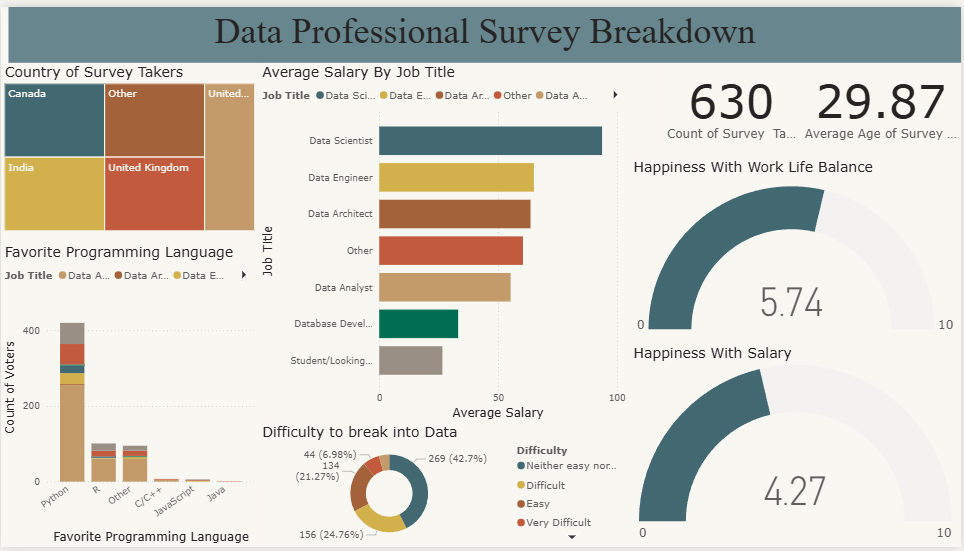

# Power BI Data Professional Survey Dashboard

## Dashboard Preview

## Project Files
- `dashboard.pbix` - Main Power BI dashboard
- `Power BI - Final Project.xlsx` - Survey dataset
- `image.png` - Dashboard preview

### Salary Analysis
- **Highest Salary**: Data Scientist
- **Second**: Data Engineer  
- **Third**: Data Architect

### Programming Languages
1. Python
2. R
3. JavaScript
4. Java
5. C/C++

### Job Satisfaction
- **Work/Life Balance**: 5.74/10
- **Average Age**: 29.87 years
- **Sample Size**: 630 professionals

### Career Entry
- 42.7%: Neutral difficulty
- 21.27%: Difficult
- 6.98%: Very difficult

## How to Use
1. Open `dashboard.pbix` in Power BI Desktop
2. View raw data in `Power BI - Final Project.xlsx`
3. See quick preview in `image.png`

## Requirements
- Power BI Desktop
- Excel (for raw data)

## Notes
- Dashboard connects to the Excel file
- Keep both files in same folder
- Screenshot shows main layout

---
*Power BI Final Project - Data Professional Survey Analysis*
